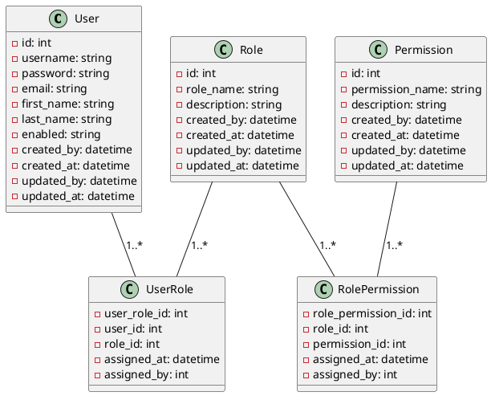

# <p align="center">Role-Based Access Control</p>

## <p align="center"> Table of Content </p>

* [Getting Started](#getting-started)
* [Dockerized](#dockerized)
* [Kubernetes](#kubernetes)
* [UI](#ui)
* [RBAC](#rbac)
* [JWT](#jwt)

## Getting Started

### Prerequisites

* [Java 21](https://www.oracle.com/java/technologies/downloads)
* [Maven 3](https://maven.apache.org/index.html)
* [Docker](https://www.docker.com)
* [Kubernetes](https://kubernetes.io)
* [jq](https://jqlang.org/)

### Build

```shell
mvn clean compile -DskipTests=true
```

### Test

```shell
mvn  test
```

### Package

```shell
mvn package -DskipTests=true
```

### Run

```shell
mvn  spring-boot:start
```

### E2eTest

```shell
# username: admin
# password: admin
curl -X 'GET' 'http://localhost:8080/api/v1/users' \
  -H 'accept: */*' \
  -H 'Authorization: Basic YWRtaW46YWRtaW4=' \
  | jq
```

### Stop

```shell
mvn  spring-boot:stop
```

## Dockerized

### Deploy

```shell
# docker command
mvn clean package
docker build -t samanalishiri/application:latest .
docker run \
	--name application \
	-p 8080:8080 \
	-h application \
	-e APP_HOST=0.0.0.0 \
	-e APP_PORT=8080 \
	-e APP_PROFILES=h2,openapibasic \
	-e DATABASE_NAME:tutorial_db \
	-itd samanalishiri/application:latest
```

```shell
# docker compose
mvn clean package
docker compose --file docker-compose.yml --project-name dev up --build -d
```

### E2eTest

```shell
# username: admin
# password: admin
curl -X 'GET' 'http://localhost:8080/api/v1/users' \
  -H 'accept: */*' \
  -H 'Authorization: Basic YWRtaW46YWRtaW4=' \
  | jq
```

### Down

```shell
docker compose --file docker-compose.yml --project-name dev down
docker rm application --force
docker image rm samanalishiri/application:latest
docker volume prune -f
```

## Kubernetes

### Deploy

```shell
mvn clean package -DskipTests=true
docker build -t samanalishiri/application:latest . --no-cache
kubectl apply -f kube-dev.yml
```

### Check Status

```shell
kubectl get all -n dev
```

### Port Forwarding

```shell
# PostgreSQL
kubectl port-forward service/postgresql 5432:5432 -n dev
```

```shell
# PgAdmin
kubectl port-forward service/pgadmin 8081:80 -n dev
```

```shell
# Adminer
kubectl port-forward service/adminer 8082:8080 -n dev
```

```shell
# Application
kubectl port-forward service/application 8080:8080 -n dev
```

### E2eTest

```shell
# username: admin
# password: admin
curl -X 'GET' 'http://localhost:8080/api/v1/users' \
  -H 'accept: */*' \
  -H 'Authorization: Basic YWRtaW46YWRtaW4=' \
  | jq
```

### Down

```shell
kubectl delete all --all -n dev
kubectl delete secrets dev-credentials -n dev
kubectl delete configMap dev-config -n dev
kubectl delete persistentvolumeclaim postgresql-pvc -n dev
kubectl delete persistentvolumeclaim pgadmin-pvc -n dev
docker image rm samanalishiri/application:latest
docker volume prune -f
```

## UI

* login: [http://localhost:8080/login](http://localhost:8080/login).
* Swagger UI: [http://localhost:8080/swagger-ui/index.html](http://localhost:8080/swagger-ui/index.html).
* OpenAPI Docs: [http://localhost:8080/v3/api-docs](http://localhost:8080/v3/api-docs).

```yaml
username: admin
password: admin
```

* PgAdmin: [http://localhost:8081](http://localhost:8081)
* Adminer: [http://localhost:8082](http://localhost:8082)

```yaml
# PostgreSQL
Host: postgresql
Port: 5432
Maintenance_database: postgres
# Adminer
Server: postgresql:5432

Username: user
Password: password
```

* H2 Console: [http://localhost:8080/h2-console](http://localhost:8080/h2-console).

```yaml
URL: jdbc:h2:mem:tutorial_db
Username: sa
Password:
```

## RBAC

Role-Based Access Control (RBAC) is a security model that restricts system access to authorized users based on their
roles within an organization. Instead of assigning permissions to individual users, RBAC associates permissions with
roles, and then users are assigned to those roles. This approach simplifies management and improves security, especially
in large organizations.

### Key Concepts

#### User

An individual who interacts with the system. Users are assigned one or more roles, determining their access level.

#### Role

A collection of permissions that define what actions a user can perform within a system. Roles are often aligned with
job functions within an organization, such as "Administrator," "Manager," or "Employee."

#### Permission

The approval to perform specific operations within a system, such as "read," "write," "edit," or "delete." Permissions
are associated with roles, not individual users.

#### Session

A mapping between a user and an activated subset of roles that the user is authorized to use during a session.

#### Role Hierarchy

Some RBAC implementations support hierarchies, where roles can inherit permissions from other roles. For example, a "
Manager" role may inherit permissions from the "Employee" role.

### Benefits

#### Simplified Administration

Managing access rights through roles rather than individual users reduces complexity, especially when onboarding or
offboarding employees.

#### Enhanced Security

By adhering to the principle of least privilege, users only have the minimum access necessary to perform their jobs.

#### Scalability

As organizations grow, adding new roles and assigning them to users is more efficient than managing individual user
permissions.

#### Compliance

Helps ensure that access controls are aligned with regulatory requirements and internal policies.

### Model

<p align="center">



</p>

## JWT

JSON Web Token (JWT) is a compact, URL-safe means of representing claims to be transferred between two parties. The
claims in a JWT are encoded as a JSON object that is digitally signed using a JSON Web Signature (JWS) and/or encrypted
using JSON Web Encryption (JWE). For more information refer to [https://jwt.io](https://jwt.io).

### Key Concepts

#### Header:

The header typically consists of two parts: the type of token (which is JWT) and the signing algorithm being used (e.g.,
HMAC SHA256 or RSA).

##### Example

```json
{
  "alg": "HS256",
  "typ": "JWT"
}
```

#### Payload:

The payload contains the claims, which are statements about an entity (typically, the user) and additional data. There
are three types of claims:
Registered Claims: Predefined claims like iss (issuer), exp (expiration time), sub (subject), and aud (audience).
Public Claims: Custom claims defined by those using the JWTs. They should be collision-resistant.
Private Claims: Custom claims intended to be shared between parties that agree on their use.

##### Example

```json
{
  "sub": "1234567890",
  "name": "John Doe",
  "admin": true
}
```

#### Signature:

To create the signature, the encoded header, the encoded payload, a secret, and the algorithm specified in the header
are combined. The signature is used to verify that the message wasn’t changed along the way and, in the case of signed
tokens, can also verify the authenticity of the sender.

##### Example using HMAC SHA256:

```textmate
HMACSHA256(
base64UrlEncode(header) + "." + base64UrlEncode(payload),
secret
)
```

### Structure of a JWT

A JWT is typically made up of three parts separated by dots (.), which are:

* Header (encoded in Base64Url)
* Payload (encoded in Base64Url)
* Signature

##

**<p align="center"> [Top](#role-based-access-control) </p>**