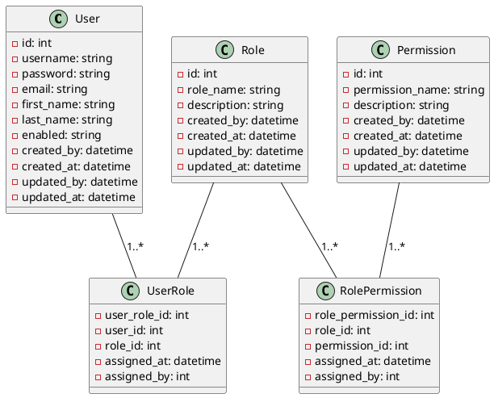

# <p align="center">Role-Based Access Control</p>

<p style="text-align: justify;">

This tutorial is about implementing RBAC by Spring Boot.

</p>

## <p align="center"> Table of Content </p>

* [Getting Started](#getting-started)
* [RBAC](#rbac)
* [JWT](#jwt)
* [Install Application on Docker](#install-application-on-docker)
* [Install Application on Kubernetes](#install-application-on-kubernetes)
* [How To Set up Spring Boot](#how-to-set-up-spring-boot)
* [How To Set up Spring Boot Test](#how-to-set-up-spring-boot-test)
* [Appendix](#appendix )

## Getting Started

### Prerequisites

* [Java 21](https://www.oracle.com/java/technologies/downloads/)
* [Maven 3](https://maven.apache.org/index.html)
* [Docker](https://www.docker.com/)
* [Kubernetes](https://kubernetes.io/)

### Pipeline

#### Build

```shell
mvn clean package -DskipTests=true 
```

#### Test

```shell
mvn test
```

#### Run

```shell
mvn  spring-boot:run
```

## RBAC

Role-Based Access Control (RBAC) is a security model that restricts system access to authorized users based on their
roles within an organization. Instead of assigning permissions to individual users, RBAC associates permissions with
roles, and then users are assigned to those roles. This approach simplifies management and improves security, especially
in large organizations.

### Key Concepts

#### User

An individual who interacts with the system. Users are assigned one or more roles, determining their access level.

#### Role

A collection of permissions that define what actions a user can perform within a system. Roles are often aligned with
job functions within an organization, such as "Administrator," "Manager," or "Employee."

#### Permission

The approval to perform specific operations within a system, such as "read," "write," "edit," or "delete." Permissions
are associated with roles, not individual users.

#### Session

A mapping between a user and an activated subset of roles that the user is authorized to use during a session.

#### Role Hierarchy

Some RBAC implementations support hierarchies, where roles can inherit permissions from other roles. For example, a "
Manager" role may inherit permissions from the "Employee" role.

### Benefits

#### Simplified Administration

Managing access rights through roles rather than individual users reduces complexity, especially when onboarding or
offboarding employees.

#### Enhanced Security

By adhering to the principle of least privilege, users only have the minimum access necessary to perform their jobs.

#### Scalability

As organizations grow, adding new roles and assigning them to users is more efficient than managing individual user
permissions.

#### Compliance

Helps ensure that access controls are aligned with regulatory requirements and internal policies.

### Model

<p align="center">



</p>

## JWT

JSON Web Token (JWT) is a compact, URL-safe means of representing claims to be transferred between two parties. The
claims in a JWT are encoded as a JSON object that is digitally signed using a JSON Web Signature (JWS) and/or encrypted
using JSON Web Encryption (JWE). For more information refer to [https://jwt.io](https://jwt.io).

### Key Concepts

#### Header:

The header typically consists of two parts: the type of token (which is JWT) and the signing algorithm being used (e.g.,
HMAC SHA256 or RSA).

##### Example

```json
{
  "alg": "HS256",
  "typ": "JWT"
}
```

#### Payload:

The payload contains the claims, which are statements about an entity (typically, the user) and additional data. There
are three types of claims:
Registered Claims: Predefined claims like iss (issuer), exp (expiration time), sub (subject), and aud (audience).
Public Claims: Custom claims defined by those using the JWTs. They should be collision-resistant.
Private Claims: Custom claims intended to be shared between parties that agree on their use.

##### Example

```json
{
  "sub": "1234567890",
  "name": "John Doe",
  "admin": true
}
```

#### Signature:

To create the signature, the encoded header, the encoded payload, a secret, and the algorithm specified in the header
are combined. The signature is used to verify that the message wasn’t changed along the way and, in the case of signed
tokens, can also verify the authenticity of the sender.

##### Example using HMAC SHA256:

```textmate
HMACSHA256(
base64UrlEncode(header) + "." + base64UrlEncode(payload),
secret
)
```

### Structure of a JWT

A JWT is typically made up of three parts separated by dots (.), which are:

* Header (encoded in Base64Url)
* Payload (encoded in Base64Url)
* Signature

## Install Application on Docker

Create a file named `docker-compose.yml` with the following configuration.

### Docker Compose

#### Application dockerfile

[Dockerfile](Dockerfile)

```dockerfile
FROM eclipse-temurin:21-jdk-alpine

ARG JAR_PATH=./target
ARG JAR_NAME=security-rbac-jwt
ARG JAR_VERSION=0.0.1-SNAPSHOT
ARG TARGET_PATH=/app
ENV APPLICATION=${TARGET_PATH}/application.jar
ENV APP_HOST=0.0.0.0
ENV APP_PORT=8080
ENV APP_PROFILES=h2

ADD ${JAR_PATH}/${JAR_NAME}-${JAR_VERSION}.jar ${TARGET_PATH}/application.jar

EXPOSE ${APP_PORT}
ENTRYPOINT java -jar ${APPLICATION}
```

#### H2 Server dockerfile

Download h2 jar file from [https://www.h2database.com/html/download.html](https://www.h2database.com/html/download.html)
into [h2server](./h2server) directory.

[Dockerfile](/h2server/Dockerfile)

```dockerfile
FROM openjdk:11-jre-slim

WORKDIR /opt/h2

COPY h2-*.jar /opt/h2/h2.jar
ENV WEB_PORT=8082
ENV TCP_PORT=9092
EXPOSE $WEB_PORT $TCP_PORT

CMD java -cp h2.jar org.h2.tools.Server \
    -web -webAllowOthers -webPort $WEB_PORT \
    -tcp -tcpAllowOthers -tcpPort $TCP_PORT \
    -baseDir /opt/h2-data -ifNotExists

```

#### Default Docker Compose

[docker-compose.yml](docker-compose.yml)

```yaml
#docker-compose.yml
version: "3.9"

services:
  securityrbacjwt:
    image: samanalishiri/securityrbacjwt:latest
    build:
      context: .
      dockerfile: ./Dockerfile
    container_name: securityrbacjwt
    hostname: securityrbacjwt
    restart: always
    ports:
      - "8080:8080"
    environment:
      APP_HOST: "0.0.0.0"
      APP_PORT: "8080"
      APP_PROFILES: h2,openapibasic
      DATABASE_NAME: tutorial_db
```

#### With Postgres Docker Compose

[docker-compose-postgres.yml](docker-compose-postgres.yml)

```yaml
version: "3.9"

services:
  postgres:
    image: postgres:13.9-alpine
    container_name: postgres
    hostname: postgres
    restart: always
    ports:
      - "5432:5432"
    environment:
      POSTGRES_USER: user
      POSTGRES_PASSWORD: password
      POSTGRES_DB: tutorial_db
  pgadmin:
    image: dpage/pgadmin4
    container_name: pgadmin
    hostname: pgadmin
    restart: always
    ports:
      - "8081:80"
    environment:
      PGADMIN_DEFAULT_EMAIL: pgadmin4@pgadmin.org
      PGADMIN_DEFAULT_PASSWORD: "password"
      PGADMIN_CONFIG_SERVER_MODE: "False"
  securityrbacjwt:
    image: samanalishiri/securityrbacjwt:latest
    build:
      context: .
      dockerfile: ./Dockerfile
    container_name: securityrbacjwt
    hostname: securityrbacjwt
    restart: always
    ports:
      - "8080:8080"
    environment:
      APP_HOST: "0.0.0.0"
      APP_PORT: "8080"
      APP_PROFILES: postgres
      DATABASE_USERNAME: user
      DATABASE_PASSWORD: password
      POSTGRESQL_HOST: postgres,openapibasic
      POSTGRESQL_PORT: 5432
      DATABASE_NAME: tutorial_db
      DATABASE_SCHEMA: user_management
```

#### With H2 Server Docker Compose

[docker-compose-h2server.yml](docker-compose-h2server.yml)

```yaml
version: "3.9"

services:
  securityrbacjwt:
    image: samanalishiri/securityrbacjwt:latest
    build:
      context: .
      dockerfile: ./Dockerfile
    container_name: securityrbacjwt
    hostname: securityrbacjwt
    restart: always
    ports:
      - "8080:8080"
    environment:
      APP_HOST: "0.0.0.0"
      APP_PORT: "8080"
      APP_PROFILES: h2server,openapibasic
      DATABASE_HOST: h2server
      DATABASE_PORT: 9092
      DATABASE_NAME: tutorial_db
  h2server:
    image: samanalishiri/h2dbserver
    build:
      context: ./h2server
      dockerfile: ./Dockerfile
    container_name: h2server
    hostname: h2server
    ports:
      - "8082:8082"
      - "9092:9092"
    environment:
      TCP_PORT: 9092
      WEB_PORT: 8082
```

### Apply Docker Compose

Execute the following command to install Application.

```shell
docker compose --file ./docker-compose.yml --project-name securityrbacjwt up --build -d
```

## Install Application on Kubernetes

Create the following files for installing Application.

### Kube Files

[app-deployment.yml](/kube/app-deployment.yml)

```yaml
#deployment.yml
apiVersion: apps/v1
kind: Deployment
metadata:
  name: securityrbacjwt
spec:
  replicas: 1
  selector:
    matchLabels:
      app: securityrbacjwt
  strategy:
    type: Recreate
  template:
    metadata:
      labels:
        app: securityrbacjwt
    spec:
      containers:
        - name: securityrbacjwt
          image: samanalishiri/securityrbacjwt:latest
          imagePullPolicy: Never
          ports:
            - containerPort: 8080
          env:
            - name: APP_HOST
              value: "0.0.0.0"
            - name: APP_PORT
              value: "8080"
            - name: APP_PROFILES
              value: postgres,openapibasic
            - name: DATABASE_USERNAME
              value: user
            - name: DATABASE_PASSWORD
              value: password
            - name: DATABASE_HOST
              value: postgres
            - name: DATABASE_PORT
              value: "5432"
            - name: DATABASE_NAME
              value: tutorial_db
            - name: DATABASE_SCHEMA
              value: user_management
```

[app-service.yml](/kube/app-service.yml)

```yaml
#service.yml
apiVersion: v1
kind: Service
metadata:
  name: securityrbacjwt
spec:
  selector:
    app: securityrbacjwt
  ports:
    - port: 8080
      targetPort: 8080
```

[postgres-secrets.yml](/kube/postgres-secrets.yml)

```yaml
#postgres-secrets.yml
apiVersion: v1
kind: Secret
metadata:
  name: postgres-secrets
type: Opaque
data:
  # value: user
  postgres-user: dXNlcg==
  # value: password
  postgres-password: cGFzc3dvcmQ=
```

[postgres-configmap.yml](/kube/postgres-configmap.yml)

```yaml
#postgres-configmap.yml
apiVersion: v1
kind: ConfigMap
metadata:
  name: postgres-configmap
data:
  postgres-database: "tutorial_db"
```

[postgres-pvc.yml](/kube/postgres-pvc.yml)

```yaml
#postgres-pvc.yml
apiVersion: v1
kind: PersistentVolumeClaim
metadata:
  name: postgres-pvc
  labels:
    app: postgres
    tier: database
spec:
  accessModes:
    - ReadWriteOnce
  resources:
    requests:
      storage: 1Gi
```

[postgres-deployment.yml](/kube/postgres-deployment.yml)

```yaml
#postgres-deployment.yml
apiVersion: apps/v1
kind: Deployment
metadata:
  name: postgres
  labels:
    app: postgres
    tier: database
spec:
  replicas: 1
  selector:
    matchLabels:
      app: postgres
      tier: database
  strategy:
    type: Recreate
  template:
    metadata:
      labels:
        app: postgres
        tier: database
    spec:
      containers:
        - name: postgres
          image: postgres:latest
          imagePullPolicy: "IfNotPresent"
          env:
            - name: POSTGRES_USER
              valueFrom:
                secretKeyRef:
                  name: postgres-secrets
                  key: postgres-user
            - name: POSTGRES_PASSWORD
              valueFrom:
                secretKeyRef:
                  name: postgres-secrets
                  key: postgres-password
            - name: POSTGRES_DB
              valueFrom:
                configMapKeyRef:
                  name: postgres-configmap
                  key: postgres-database
            - name: PGDATA
              value: /data/postgres
          ports:
            - name: postgres
              containerPort: 5432
          volumeMounts:
            - name: postgres-storage
              mountPath: /var/lib/postgresql/data
      volumes:
        - name: postgres-storage
          persistentVolumeClaim:
            claimName: postgres-pvc
```

[postgres-service.yml](/kube/postgres-service.yml)

```yaml
#postgres-service.yml
apiVersion: v1
kind: Service
metadata:
  name: postgres
  labels:
    app: postgres
    tier: database
spec:
  selector:
    app: postgres
    tier: database

  ports:
    - port: 5432
      targetPort: 5432
```

[pgadmin-secrets.yml](/kube/pgadmin-secrets.yml)

```yaml
#pgadmin-secrets.yml
apiVersion: v1
kind: Secret
metadata:
  name: pgadmin-secrets
type: Opaque
data:
  # value: password
  pgadmin_default_password: cGFzc3dvcmQ=
```

[pgadmin-deployment.yml](/kube/pgadmin-deployment.yml)

```yaml
#pgadmin-deployment.yml
apiVersion: apps/v1
kind: Deployment
metadata:
  name: pgadmin
spec:
  replicas: 1
  selector:
    matchLabels:
      app: pgadmin
  strategy:
    type: Recreate
  template:
    metadata:
      labels:
        app: pgadmin
    spec:
      containers:
        - name: pgadmin
          image: dpage/pgadmin4
          ports:
            - containerPort: 80
          env:
            - name: PGADMIN_DEFAULT_EMAIL
              value: pgadmin4@pgadmin.org
            - name: PGADMIN_DEFAULT_PASSWORD
              valueFrom:
                secretKeyRef:
                  name: pgadmin-secrets
                  key: pgadmin_default_password
            - name: PGADMIN_CONFIG_SERVER_MODE
              value: "False"
```

[pgadmin-service.yml](/kube/pgadmin-service.yml)

```yaml
#pgadmin-service.yml
apiVersion: v1
kind: Service
metadata:
  name: pgadmin
spec:
  selector:
    app: pgadmin
  ports:
    - port: 80
      targetPort: 80
```

### Apply Kube Files

Execute the following commands to install the tools on Kubernetes.

```shell
kubectl apply -f ./kube/postgres-pvc.yml
kubectl apply -f ./kube/postgres-configmap.yml
kubectl apply -f ./kube/postgres-secrets.yml
kubectl apply -f ./kube/postgres-deployment.yml
kubectl apply -f ./kube/postgres-service.yml
kubectl apply -f ./kube/pgadmin-secrets.yml
kubectl apply -f ./kube/pgadmin-deployment.yml
kubectl apply -f ./kube/pgadmin-service.yml
kubectl apply -f ./kube/app-deployment.yml
kubectl apply -f ./kube/app-service.yml
```

### Check Status

```shell
kubectl get all
```

### Port Forwarding

<p style="text-align: justify;">

In order to connect to Application from localhost through the web browser use the following
URL [http://localhost:8080](http://localhost:8080).

</p>

```shell
kubectl port-forward service/securityrbacjwt 8080:8080
```

<p style="text-align: justify;">

In order to connect to PostgreSQL from localhost use the following command.

</p>

```shell
kubectl port-forward service/postgres 5432:5432
```

<p style="text-align: justify;">

In order to connect to PGAdmin from localhost through the web browser use the following command and dashboard of
PGAdmin is available on [http://localhost:8081](http://localhost:8081) URL.

</p>

```shell
kubectl port-forward service/pgadmin 8081:80
```

## How To Set up Spring Boot

### Dependencies

```xml

<dependencies>
    <!--spring-->
    <dependency>
        <groupId>org.springframework.boot</groupId>
        <artifactId>spring-boot-starter-web</artifactId>
        <exclusions>
            <exclusion>
                <groupId>org.springframework.boot</groupId>
                <artifactId>spring-boot-starter-logging</artifactId>
            </exclusion>
        </exclusions>
    </dependency>
    <dependency>
        <groupId>org.springframework.boot</groupId>
        <artifactId>spring-boot-starter-log4j2</artifactId>
    </dependency>
    <dependency>
        <groupId>org.springframework.boot</groupId>
        <artifactId>spring-boot-starter-validation</artifactId>
    </dependency>
    <!--security-->
    <dependency>
        <groupId>org.springframework.boot</groupId>
        <artifactId>spring-boot-starter-security</artifactId>
    </dependency>
    <!--database-->
    <dependency>
        <groupId>org.springframework.boot</groupId>
        <artifactId>spring-boot-starter-data-jpa</artifactId>
    </dependency>
    <dependency>
        <groupId>org.springframework.data</groupId>
        <artifactId>spring-data-envers</artifactId>
        <version>3.3.6</version>
    </dependency>
    <dependency>
        <groupId>org.postgresql</groupId>
        <artifactId>postgresql</artifactId>
    </dependency>
    <dependency>
        <groupId>com.h2database</groupId>
        <artifactId>h2</artifactId>
    </dependency>
    <!--utils-->
    <dependency>
        <groupId>com.fasterxml.jackson.core</groupId>
        <artifactId>jackson-core</artifactId>
    </dependency>
    <dependency>
        <groupId>com.fasterxml.jackson.core</groupId>
        <artifactId>jackson-databind</artifactId>
    </dependency>
    <dependency>
        <groupId>com.fasterxml.jackson.core</groupId>
        <artifactId>jackson-annotations</artifactId>
    </dependency>
    <dependency>
        <groupId>io.jsonwebtoken</groupId>
        <artifactId>jjwt-api</artifactId>
        <version>0.12.3</version>
    </dependency>
    <dependency>
        <groupId>io.jsonwebtoken</groupId>
        <artifactId>jjwt-impl</artifactId>
        <version>0.12.3</version>
    </dependency>
    <dependency>
        <groupId>io.jsonwebtoken</groupId>
        <artifactId>jjwt-jackson</artifactId>
        <version>0.12.3</version>
    </dependency>
    <!--rest documentation-->
    <dependency>
        <groupId>org.springdoc</groupId>
        <artifactId>springdoc-openapi-starter-webmvc-ui</artifactId>
        <version>2.3.0</version>
    </dependency>
    <!--developer-->
    <dependency>
        <groupId>org.springframework.boot</groupId>
        <artifactId>spring-boot-starter-actuator</artifactId>
    </dependency>
    <dependency>
        <groupId>org.springframework.boot</groupId>
        <artifactId>spring-boot-devtools</artifactId>
        <scope>runtime</scope>
        <optional>true</optional>
    </dependency>
</dependencies>
```

### Application Properties

#### Main Profile

```yaml
# application.yml
server:
  address: ${APP_HOST:0.0.0.0}
  port: ${APP_PORT:8080}
spring:
  main:
    banner-mode: OFF
  profiles:
    active: ${APP_PROFILES:h2,openapibasic}

secure-resource:
  unsecure-urls:
    - /login
    - /swagger-ui/**
    - /v3/api-docs/**
  home-url: /api/v1/token/me/new
  cors-origin-urls:
    - http://localhost:*
  cors-http-methods:
    - GET
    - POST
    - PUT
    - PATCH
    - DELETE
    - HEAD
    - OPTIONS
  cors-http-headers:
    - Authorization
    - Content-Type
  base-path: /**

```

#### H2 Profile

```yaml
# application-h2.yml
spring:
  datasource:
    username: ${DATABASE_USERNAME:sa}
    password: ${DATABASE_PASSWORD:}
    url: jdbc:h2:mem:${DATABASE_NAME:tutorial_db}
    driver-class-name: org.h2.Driver
  data:
    jdbc:
      repositories:
        enabled: true
  jpa:
    database: H2
    database-platform: org.hibernate.dialect.H2Dialect
    defer-datasource-initialization: true
    hibernate:
      ddl-auto: create-drop
    properties:
      javax:
        persistence:
          create-database-schemas: false
      hibernate:
        naming-strategy: org.hibernate.cfg.ImprovedNamingStrategy
        default_schema: ""
  h2:
    console:
      enabled: true
      path: ${H2_CONSOLE:/h2-console}
  sql:
    init:
      data-locations: classpath:data-h2.sql

secure-resource:
  unsecure-urls:
    - /h2-console/**
    - /swagger-ui/**
    - /v3/api-docs/**
```

#### H2 Server Profile

```yaml
# application-h2server.yml
spring:
  datasource:
    username: ${DATABASE_USERNAME:sa}
    password: ${DATABASE_PASSWORD:}
    url: jdbc:h2:tcp://${DATABASE_HOST:localhost}:${DATABASE_PORT:9092}/mem:${DATABASE_NAME:tutorial_db}
    driver-class-name: org.h2.Driver
  data:
    jdbc:
      repositories:
        enabled: true
  jpa:
    database: H2
    database-platform: org.hibernate.dialect.H2Dialect
    defer-datasource-initialization: true
    hibernate:
      ddl-auto: create-drop
    properties:
      javax:
        persistence:
          create-database-schemas: false
      hibernate:
        naming-strategy: org.hibernate.cfg.ImprovedNamingStrategy
        default_schema: ""
  sql:
    init:
      data-locations: classpath:data-h2.sql
      mode: always

secure-resource:
  unsecure-urls:
    - /swagger-ui/**
    - /v3/api-docs/**
```

#### Postgres Profile

```yaml
# application-postgres.yml
spring:
  main:
    banner-mode: OFF
  datasource:
    username: ${DATABASE_USERNAME:user}
    password: ${DATABASE_PASSWORD:password}
    url: jdbc:postgresql://${DATABASE_HOST:localhost}:${DATABASE_PORT:5432}/${DATABASE_NAME:tutorial_db}
    driver-class-name: org.postgresql.Driver
  data:
    jpa:
      repositories:
        enabled: true
  jpa:
    database: POSTGRESQL
    database-platform: org.hibernate.dialect.PostgreSQLDialect
    defer-datasource-initialization: true
    hibernate:
      ddl-auto: update
    properties:
      javax:
        persistence:
          create-database-schemas: true
      hibernate:
        naming-strategy: org.hibernate.cfg.ImprovedNamingStrategy
        default_schema: ${DATABASE_SCHEMA:user_management}
  sql:
    init:
      mode: always

secure-resource:
  unsecure-urls:
    - /swagger-ui/**
    - /v3/api-docs/**
```

## How To Set up Spring Boot Test

### Dependencies

```xml

<dependencies>
    <!--test-->
    <dependency>
        <groupId>org.springframework.boot</groupId>
        <artifactId>spring-boot-starter-test</artifactId>
        <scope>test</scope>
    </dependency>
    <dependency>
        <groupId>org.springframework.security</groupId>
        <artifactId>spring-security-test</artifactId>
        <scope>test</scope>
    </dependency>
    <dependency>
        <groupId>io.rest-assured</groupId>
        <artifactId>rest-assured</artifactId>
    </dependency>
    <dependency>
        <groupId>net.datafaker</groupId>
        <artifactId>datafaker</artifactId>
        <version>2.3.1</version>
    </dependency>
</dependencies>
```

## Appendix

### Makefile

```shell
build:
	mvn clean package -DskipTests=true

test:
	mvn test

run:
	mvn spring-boot:run

docker-build:
	docker build -t samanalishiri/securityrbacjwt:latest .

docker-deploy:
	docker run \
	--name securityrbacjwt \
	-p 8080:8080 \
	-h securityrbacjwt \
	-e APP_HOST=0.0.0.0 \
	-e APP_PORT=8080 \
	-e APP_PROFILES=h2 \
	-itd samanalishiri/securityrbacjwt:latest

DockerComposeDeploy:
	docker compose --file ./docker-compose.yml --project-name securityrbacjwt up --build -d

docker-remove-container:
	docker rm securityrbacjwt --force
	docker rm pgadmin --force
	docker rm postgres --force

DockerRemoveImage:
	docker image rm samanalishiri/securityrbacjwt:latest
	docker image rm dpage/pgadmin4
	docker image rm postgres:13.9-alpine

kube-deploy:
	kubectl apply -f ./kube/postgres-pvc.yml
	kubectl apply -f ./kube/postgres-configmap.yml
	kubectl apply -f ./kube/postgres-secrets.yml
	kubectl apply -f ./kube/postgres-deployment.yml
	kubectl apply -f ./kube/postgres-service.yml
	kubectl apply -f ./kube/pgadmin-secrets.yml
	kubectl apply -f ./kube/pgadmin-deployment.yml
	kubectl apply -f ./kube/pgadmin-service.yml
	kubectl apply -f ./kube/app-deployment.yml
	kubectl apply -f ./kube/app-service.yml

kube-delete:
	kubectl delete all --all
	kubectl delete secrets postgres-secrets
	kubectl delete configMap postgres-configmap
	kubectl delete persistentvolumeclaim postgres-pvc
	kubectl delete secrets pgadmin-secrets
	kubectl delete ingress pgadmin

kube-port-forward-app:
	kubectl port-forward service/securityrbacjwt 8080:8080

kube-port-forward-postgres:
	kubectl port-forward service/postgres 5432:5432

kube-port-forward-pgadmin:
	kubectl port-forward service/pgadmin 8081:80

```

##

**<p align="center"> [Top](#role-based-access-control) </p>**