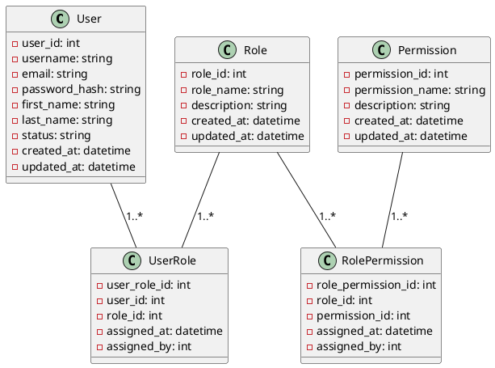

# <p align="center">Role-Based Access Control</p>

<p align="justify">

This tutorial is about integration of Spring Boot and RBAC.

</p>

## <p align="center"> Table of Content </p>

* [Getting Started](#getting-started)
* [RBAC](#rbac)
* [RBAC Use Cases](#rbac-use-cases)
* [Install Application on Docker](#install-app-on-docker)
* [Install Application on Kubernetes](#install-app-on-kubernetes)
* [How To Set up Spring Boot](#how-to-set-up-spring-boot)
* [How To Set up Spring Boot Test](#how-to-set-up-spring-boot-test)
* [Appendix](#appendix )

## Getting Started

### Prerequisites

* [Java 21](https://www.oracle.com/java/technologies/downloads/)
* [Maven 3](https://maven.apache.org/index.html)
* [Docker](https://www.docker.com/)
* [Kubernetes](https://kubernetes.io/)

### Pipeline

#### Build

```bash
mvn clean package -DskipTests=true 
```

#### Test

```bash
mvn test
```

#### Run

```bash
mvn  spring-boot:run
```

```yaml
URL: http://localhost:8080
```

## RBAC

Role-Based Access Control (RBAC) is a security model that restricts system access to authorized users based on their
roles within an organization. Instead of assigning permissions to individual users, RBAC associates permissions with
roles, and then users are assigned to those roles. This approach simplifies management and improves security, especially
in large organizations.

### Key Concepts

#### User

An individual who interacts with the system. Users are assigned one or more roles, determining their access level.

#### Role

A collection of permissions that define what actions a user can perform within a system. Roles are often aligned with
job functions within an organization, such as "Administrator," "Manager," or "Employee."

#### Permission

The approval to perform specific operations within a system, such as "read," "write," "edit," or "delete." Permissions
are associated with roles, not individual users.

#### Session

A mapping between a user and an activated subset of roles that the user is authorized to use during a session.

#### Role Hierarchy

Some RBAC implementations support hierarchies, where roles can inherit permissions from other roles. For example, a "
Manager" role may inherit permissions from the "Employee" role.

### Benefits

#### Simplified Administration

Managing access rights through roles rather than individual users reduces complexity, especially when onboarding or
offboarding employees.

#### Enhanced Security

By adhering to the principle of least privilege, users only have the minimum access necessary to perform their jobs.

#### Scalability

As organizations grow, adding new roles and assigning them to users is more efficient than managing individual user
permissions.

#### Compliance

Helps ensure that access controls are aligned with regulatory requirements and internal policies.

### Model

<p align="center">



</p>

## JWT

JSON Web Token (JWT) is a compact, URL-safe means of representing claims to be transferred between two parties. The
claims in a JWT are encoded as a JSON object that is digitally signed using a JSON Web Signature (JWS) and/or encrypted
using JSON Web Encryption (JWE). For more information refer to [https://jwt.io](https://jwt.io).

### Key Concepts

#### Header:

The header typically consists of two parts: the type of token (which is JWT) and the signing algorithm being used (e.g.,
HMAC SHA256 or RSA).

##### Example

```json
{
  "alg": "HS256",
  "typ": "JWT"
}
```

#### Payload:

The payload contains the claims, which are statements about an entity (typically, the user) and additional data. There
are three types of claims:
Registered Claims: Predefined claims like iss (issuer), exp (expiration time), sub (subject), and aud (audience).
Public Claims: Custom claims defined by those using the JWTs. They should be collision-resistant.
Private Claims: Custom claims intended to be shared between parties that agree on their use.

##### Example

```json
{
  "sub": "1234567890",
  "name": "John Doe",
  "admin": true
}
```

#### Signature:

To create the signature, the encoded header, the encoded payload, a secret, and the algorithm specified in the header
are combined. The signature is used to verify that the message wasn’t changed along the way and, in the case of signed
tokens, can also verify the authenticity of the sender.

##### Example using HMAC SHA256:

```textmate
HMACSHA256(
base64UrlEncode(header) + "." + base64UrlEncode(payload),
secret
)
```

### Structure of a JWT

A JWT is typically made up of three parts separated by dots (.), which are:

* Header (encoded in Base64Url)
* Payload (encoded in Base64Url)
* Signature

## Install Application on Docker

Create a file named `docker-compose.yml` with the following configuration.

### Docker Compose

[Dockerfile](Dockerfile)

```dockerfile
FROM eclipse-temurin:21-jdk-alpine

ARG JAR_PATH=./target
ARG JAR_NAME=security-rbac
ARG JAR_VERSION=0.0.1-SNAPSHOT
ARG TARGET_PATH=/app
ENV APPLICATION=${TARGET_PATH}/application.jar
ENV PORT=8080

ADD ${JAR_PATH}/${JAR_NAME}-${JAR_VERSION}.jar ${TARGET_PATH}/application.jar

EXPOSE ${PORT}
ENTRYPOINT java -jar ${APPLICATION}
```

[docker-compose.yml](docker-compose.yml)

```yaml
#docker-compose.yml
version: "3.8"

services:
  postgresql:
    image: postgres:13.9-alpine
    container_name: postgresql
    hostname: postgresql
    restart: always
    ports:
      - "5432:5432"
    environment:
      POSTGRES_USER: user
      POSTGRES_PASSWORD: password
      POSTGRES_DB: test_db
  pgadmin:
    image: dpage/pgadmin4
    container_name: pgadmin
    hostname: pgadmin
    restart: always
    ports:
      - "8081:80"
    environment:
      PGADMIN_DEFAULT_EMAIL: pgadmin4@pgadmin.org
      PGADMIN_DEFAULT_PASSWORD: "password"
      PGADMIN_CONFIG_SERVER_MODE: "False"
  securityrbac:
    image: samanalishiri/securityrbac:latest
    build:
      context: .
      dockerfile: ./Dockerfile
    container_name: securityrbac
    hostname: securityrbac
    restart: always
    ports:
      - "8080:8080"
    environment:
      APP_HOST: "0.0.0.0"
      APP_PORT: "8080"
      DATABASE_USERNAME: user
      DATABASE_PASSWORD: password
      POSTGRESQL_HOST: postgresql
      POSTGRESQL_PORT: 5432
      DATABASE_NAME: test_db
```

### Apply Docker Compose

Execute the following command to install Application.

```shell
docker compose --file ./docker-compose.yml --project-name securityrbac up --build -d
```

## Install Application on Kubernetes

Create the following files for installing Application.

### Kube Files

[app-deployment.yml](/kube/app-deployment.yml)

```yaml
#deployment.yml
```

[app-service.yml](/kube/app-service.yml)

```yaml
#service.yml
```

### Apply Kube Files

Execute the following commands to install the tools on Kubernetes.

```shell
kubectl apply -f ./kube/app-deployment.yml
kubectl apply -f ./kube/app-service.yml
```

### Check Status

```shell
kubectl get all
```

### Port Forwarding

<p align="justify">

In order to connect to Application from localhost through the web browser use the following command and dashboard of
Application is available on [http://localhost:port](http://localhost:port) URL.

</p>

```shell
kubectl port-forward service/securityrbac port:port
```

## How To Set up Spring Boot

### Dependencies

```xml
<dependencies>
    <!--spring-->
    <dependency>
        <groupId>org.springframework.boot</groupId>
        <artifactId>spring-boot-starter-web</artifactId>
        <exclusions>
            <exclusion>
                <groupId>org.springframework.boot</groupId>
                <artifactId>spring-boot-starter-logging</artifactId>
            </exclusion>
        </exclusions>
    </dependency>
    <dependency>
        <groupId>org.springframework.boot</groupId>
        <artifactId>spring-boot-starter-log4j2</artifactId>
    </dependency>
    <dependency>
        <groupId>org.springframework.boot</groupId>
        <artifactId>spring-boot-starter-validation</artifactId>
    </dependency>
    <dependency>
        <groupId>org.springframework.boot</groupId>
        <artifactId>spring-boot-starter-security</artifactId>
    </dependency>
    <!--database-->
    <dependency>
        <groupId>org.springframework.boot</groupId>
        <artifactId>spring-boot-starter-data-jpa</artifactId>
    </dependency>
    <dependency>
        <groupId>org.postgresql</groupId>
        <artifactId>postgresql</artifactId>
    </dependency>
    <dependency>
        <groupId>com.h2database</groupId>
        <artifactId>h2</artifactId>
        <scope>runtime</scope>
    </dependency>
    <!--utils-->
    <dependency>
        <groupId>com.fasterxml.jackson.core</groupId>
        <artifactId>jackson-core</artifactId>
    </dependency>
    <dependency>
        <groupId>com.fasterxml.jackson.core</groupId>
        <artifactId>jackson-databind</artifactId>
    </dependency>
    <dependency>
        <groupId>com.fasterxml.jackson.core</groupId>
        <artifactId>jackson-annotations</artifactId>
    </dependency>
    <dependency>
        <groupId>io.jsonwebtoken</groupId>
        <artifactId>jjwt-api</artifactId>
        <version>0.12.3</version>
    </dependency>
    <dependency>
        <groupId>io.jsonwebtoken</groupId>
        <artifactId>jjwt-impl</artifactId>
        <version>0.12.3</version>
    </dependency>
    <dependency>
        <groupId>io.jsonwebtoken</groupId>
        <artifactId>jjwt-jackson</artifactId>
        <version>0.12.3</version>
    </dependency>
    <!--rest documentation-->
    <dependency>
        <groupId>org.springdoc</groupId>
        <artifactId>springdoc-openapi-starter-webmvc-ui</artifactId>
        <version>2.3.0</version>
    </dependency>
</dependencies>
```

### Application Properties

```yaml
# application.yml
server:
  address: ${APP_HOST:0.0.0.0}
  port: ${APP_PORT:8080}
spring:
  main:
    banner-mode: OFF
  datasource:
    username: ${DATABASE_USERNAME:user}
    password: ${DATABASE_PASSWORD:password}
    url: jdbc:postgresql://${POSTGRESQL_HOST:localhost}:${POSTGRESQL_PORT:5432}/${DATABASE_NAME:test_db}
    driver-class-name: org.postgresql.Driver
  data:
    jpa:
      repositories:
        enabled: true
  jpa:
    database: POSTGRESQL
    database-platform: org.hibernate.dialect.PostgreSQLDialect
    defer-datasource-initialization: true
    show-sql: true
    hibernate:
      ddl-auto: update
    properties:
      javax:
        persistence:
          create-database-schemas: true
      hibernate:
        generate_statistics: true
        format_sql: true
        naming-strategy: org.hibernate.cfg.ImprovedNamingStrategy
        default_schema: ${DATABASE_SCHEMA:user_management}
  sql:
    init:
      mode: always
```

## How To Set up Spring Boot Test

### Dependencies

```xml
<dependencies>
    <!--test-->
    <dependency>
        <groupId>org.springframework.boot</groupId>
        <artifactId>spring-boot-starter-test</artifactId>
        <scope>test</scope>
    </dependency>
    <dependency>
        <groupId>org.springframework.security</groupId>
        <artifactId>spring-security-test</artifactId>
        <scope>test</scope>
    </dependency>
    <dependency>
        <groupId>io.rest-assured</groupId>
        <artifactId>rest-assured</artifactId>
    </dependency>
    <dependency>
        <groupId>net.datafaker</groupId>
        <artifactId>datafaker</artifactId>
        <version>2.3.1</version>
    </dependency>
</dependencies>
```

### Application Properties

```yaml
# application-test.yml
spring:
  datasource:
    username: sa
    password: ''
    url: jdbc:h2:mem:${DATABASE_NAME:test_db}
    driver-class-name: org.h2.Driver
  jpa:
    database: H2
    database-platform: org.hibernate.dialect.H2Dialect
    hibernate:
      ddl-auto: create-drop
    properties:
      javax:
        persistence:
          create-database-schemas: false
      hibernate:
        default_schema: ""
  h2:
    console:
      enabled: true
      path: ${H2_CONSOLE:/h2-console}
  sql:
    init:
      data-locations: classpath:data-h2.sql
```

## Appendix

### Makefile

```shell
build:
	mvn clean package -DskipTests=true

test:
	mvn test

run:
	mvn spring-boot:run
	
docker-compose-deploy:
	docker compose --file docker-compose.yml --project-name tools-name up --build -d

docker-remove-container:
	docker rm tools-name --force

docker-remove-image:
	docker image rm image-name

kube-deploy:
	kubectl apply -f ./kube/tools-name-deployment.yml
	kubectl apply -f ./kube/tools-name-service.yml

kube-delete:
	kubectl delete all --all

kube-port-forward-db:
	kubectl port-forward service/tools-name port:port
```

##

**<p align="center"> [Top](#attribute-based-access-control) </p>**